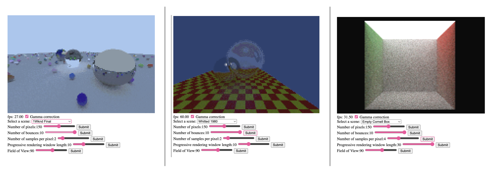

# Realtime Software Raytracing

This is a super simple realtime ray tracer following Peter Shirley's [Ray Tracing in One Weekend](https://raytracing.github.io/) series. The implementation is purely written in TypeScript and the rendering is purely written on the CPU (i.e. no graphics APIs). As such, it is extremely inefficient and low quality, but it can still run in real time!

A live demo is available [here](https://sbobyn.github.io/software-raytracing.ts/)

To build the code locally, ensure TypeScript is installed, run `make` and open up the build directory on a locally hosted server.

# Camera Controls

Use WASD to move around the scene and click and drag on the canvas to look aroud.

# Sample Renders

# To do

- add high-res offline render feature. This should be offloaded to a background thread so UI isn't blocked
- bvh toggle in the UI to evaluate performance increase
- visualize BVH implementation
- Ray Tracing in One Weekend
  - depth of field / defocus blur. To physically simulate this requires many rays and can't be done in realtime with this simple implementation. I may leave this. a fast heuristic could be to add a depth buffer and a blur filter that blurs pixels proportionally to their buffer's distance from the focal length.
- Ray Tracing in One Weekend: The Next Week
  - motion blur
  - instancing
  - implement final scene
- Ray Tracing in One Weekend: The Rest of Your Life
  - work through this book.

🚧🚧🚧 Work in Progress 🚧🚧🚧

- this was my first TypeScript project and the code is a bit of a mess. I will clean it up eventually
